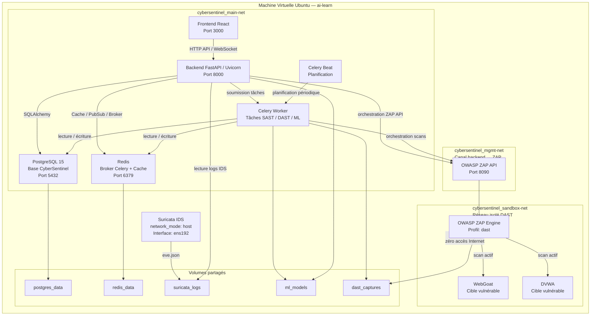

```mermaid
flowchart TB

    %% =========================
    %% HOST / VM
    %% =========================
    subgraph HOST["Machine Virtuelle Ubuntu — ai-learn"]

        SUR["Suricata IDS<br/>network_mode: host<br/>Interface: ens192"]

        %% =========================
        %% MAIN NETWORK
        %% =========================
        subgraph MAIN["cybersentinel_main-net<br/>Réseau principal"]
            FRONT["Frontend React<br/>Port 3000"]
            BACK["Backend FastAPI / Uvicorn<br/>Port 8000"]
            REDIS["Redis<br/>Broker Celery + Cache<br/>Port 6379"]
            POSTGRES["PostgreSQL 15<br/>Base CyberSentinel<br/>Port 5432"]
            WORKER["Celery Worker<br/>Tâches SAST / DAST / ML"]
            BEAT["Celery Beat<br/>Planification"]
        end

        %% =========================
        %% MANAGEMENT NETWORK
        %% =========================
        subgraph MGMT["cybersentinel_mgmt-net<br/>Canal backend ↔ ZAP"]
            ZAP_MGMT["OWASP ZAP API<br/>Port 8090"]
        end

        %% =========================
        %% SANDBOX NETWORK
        %% =========================
        subgraph SANDBOX["cybersentinel_sandbox-net<br/>Réseau isolé DAST"]
            ZAP_SANDBOX["OWASP ZAP Engine<br/>Profil: dast"]
            WEBGOAT["WebGoat<br/>Cible vulnérable"]
            DVWA["DVWA<br/>Cible vulnérable"]
        end

        %% =========================
        %% SHARED VOLUMES
        %% =========================
        subgraph VOLS["Volumes partagés"]
            V1["postgres_data"]
            V2["redis_data"]
            V3["suricata_logs"]
            V4["ml_models"]
            V5["dast_captures"]
        end
    end

    %% =========================
    %% RELATIONS MAIN-NET
    %% =========================
    FRONT -->|"HTTP API / WebSocket"| BACK

    BACK -->|"SQLAlchemy"| POSTGRES
    BACK -->|"Cache / PubSub / Broker"| REDIS
    BACK -->|"soumission tâches"| WORKER

    BEAT -->|"planification périodique"| WORKER
    WORKER -->|"lecture / écriture"| REDIS
    WORKER -->|"lecture / écriture"| POSTGRES

    %% =========================
    %% SURICATA HOST MODE
    %% =========================
    SUR -->|"eve.json"| V3
    BACK -->|"lecture logs IDS"| V3

    %% =========================
    %% DAST COMMUNICATION
    %% =========================
    BACK -->|"orchestration ZAP API"| ZAP_MGMT
    WORKER -->|"orchestration scans"| ZAP_MGMT

    ZAP_MGMT --- ZAP_SANDBOX
    ZAP_SANDBOX -->|"scan actif"| WEBGOAT
    ZAP_SANDBOX -->|"scan actif"| DVWA

    %% =========================
    %% VOLUMES
    %% =========================
    POSTGRES --> V1
    REDIS --> V2
    WORKER --> V4
    BACK --> V4
    ZAP_SANDBOX --> V5
    WORKER --> V5

    %% =========================
    %% SECURITY NOTE
    %% =========================
    SANDBOX -. "internal: true<br/>zéro accès Internet" .- HOST
```